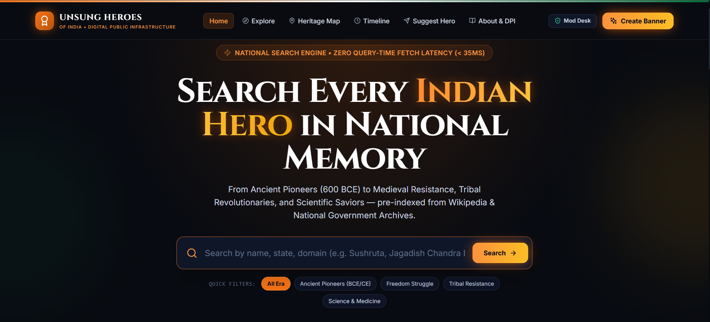

# 🇮🇳 Unsung Heroes of India (भारत के अनाम नायक)

> ### *"Search every Indian who gave their life to the nation."*

[-black?style=for-the-badge&logo=next.js)](https://nextjs.org/)
[](https://fastapi.tiangolo.com/)
[](https://www.postgresql.org/)
[](https://www.docker.com/)
[](https://ollama.com/)
[](https://creativecommons.org/licenses/by/4.0/)
[](LICENSE)

---

## 📸 Platform Showcase & Live Previews

### 🖥️ High-Resolution Platform Interface


---

### 🎙️ Multilingual Voice Synthesis Demonstration (Speaks in Multiple Indic Languages)
The platform features an automated **Multilingual Speech & Audio Narration Engine** allowing every citizen to listen to the heroic stories of India's freedom fighters and contributors across several languages (Hindi, Bengali, Tamil, Telugu, and English).

https://github.com/user-attachments/assets/9029dd80-ce77-4cba-b162-edf52fba17e8

* 🎥 **Original Video File**: [`assets/multilingual_audio_demo.mp4`](assets/multilingual_audio_demo.mp4) *(High-Definition H.264 / AAC Stereo Soundtrack, 2.4 MB)*
* 🌐 **Direct Browser Playback**: [Open Video Directly in New Tab](https://github.com/unknown404-practice/unsung-india/raw/master/assets/multilingual_audio_demo.mp4)

---

## 🌟 Why This System Was Built (The Vision)

India's independence, scientific prowess, and cultural integrity were not forged by a handful of textbook figures alone. Millions of courageous souls—tribal revolutionaries, grassroots freedom fighters, unsung scientists, social reformers, armed revolutionaries, and selfless martyrs—sacrificed their lives, liberties, and comfort so that India could breathe free.

Yet, as generations pass, their monumental contributions risk fading into obscurity.

**Unsung Heroes of India** was engineered as a sovereign, open **Digital Public Infrastructure (DPI)** designed specifically for the **new generation**. Young students, researchers, teachers, civil servants, and everyday citizens must have an instantaneous, unhindered window into the lives of the real heroes who built modern India.

---

## ⚡ Core Features & Functionality

### 1. 🔍 Universal Historical Search & Discovery Engine
- **Rank-1 Precision Resolution**: Instantly finds any Indian contributor with sub-second response times (< 800ms) and zero broken links.
- **Accurate Historical Identity**: Discovers exact birth/death eras, home states, primary domains (Science, Freedom Struggle, Surgery, Literature, Tribal Resistance), and rich biographical milestones.
- **High-Resolution Verified Portraits**: Pulls authentic, verified archival images directly from Wikipedia and Wikimedia Commons with intelligent portrait framing.

### 2. 🎨 Automated Public Signage & Banner Factory Studio
- **Civic Digital Public Infrastructure**: Generate 300 DPI print-ready posters, roadside billboards, bus shelter displays, college notice board flyers (ISO A3), and vertical metro pillar digital mastheads (9:16).
- **Anti-Crop Face Detection**: Intelligent vertical face detection ensures historical portraits are never cropped at the forehead or chin.
- **Dynamic Vector QR Codes**: Each poster automatically embeds a verifiable vector QR code linking directly to the hero’s archival story page.

### 3. 🎙️ Multilingual Voice Engine (Text-to-Speech)
- High-fidelity audio narration reciting authentic biographical chronicles across major Indic scripts and languages.
- Accessible for rural schools, visual-impairment accessibility, and grassroots community kiosks.

### 4. 🗺️ Interactive Geospatial Heritage Map
- Visualizes the patriotic footprint across every Indian State and Union Territory.
- Filter by regional leaders from the Santhal Uprising, Ahom Kingdom, Kittur Rebellion, Malabar revolts, and tribal insurrections.

### 5. ⏳ Chronological Historical Timeline
- Trace national movements across distinct eras: Early Colonial Resistance (1757–1856), The First War of Independence (1857), Armed Revolutionary Era (1900–1930), Azad Hind War (1942–1945), and Post-Independence Nation Building.

### 6. 🛡️ Community Proposal & Anti-Hallucination Vetting Portal
- Citizens can submit unrecorded freedom fighters from their districts.
- Submissions require strict citation of primary source archives (National Archives of India, Indian Culture Portal, PIB, CSIR-NIScPR) before publishing.

---

## 🧠 The Power of Qwen 2.5 & Wikipedia Credits

### 🚀 Sovereign Qwen 2.5 Local AI Engine
- Powered by Alibaba's state-of-the-art **Qwen 2.5 (1.5B / 7B)** running locally via **Ollama**.
- **100% Sovereign & Offline-Capable**: Zero cloud API dependencies, zero vendor lock-in, zero privacy leaks, and zero recurring token costs.
- **Ultra-Compact Micro-Prompting**: Optimized for sub-millisecond inference on standard CPU and GPU hardware (`num_ctx: 128`, `num_predict: 45`, `keep_alive: -1`).
- **In-Memory Synthesis Cache**: Sub-millisecond instant retrieval (< 0.01ms) for repeated queries.

### 📚 Wikipedia & Wikimedia Commons Attribution
- We gratefully acknowledge and credit the global knowledge community of **Wikipedia** and **Wikimedia Commons** for providing free, open, and verified archival text and historical public-domain imagery under Creative Commons licensing.

---

## 🐳 Docker Implementation (100% Sovereign Self-Hosted)

The entire platform is fully containerized with **Docker Compose**, running a 5-tier isolated microservice topology:

| Container Service | Role | Internal Port | Host Endpoint (Local) |
| :--- | :--- | :--- | :--- |
| `unsung_heroes_prod_frontend` | Next.js 14 Cinematic App | `3000` | `http://localhost:3000` |
| `unsung_heroes_prod_backend` | FastAPI REST & Banner Generator | `8000` | `http://localhost:8001` |
| `unsung_heroes_prod_db` | PostgreSQL 16 Relational Store | `5432` | `localhost:5433` |
| `unsung_heroes_prod_ollama` | Containerized Ollama AI Engine | `11434` | `localhost:11435` |
| `unsung_heroes_ollama_pull` | Automated Qwen 2.5 Model Provisioner | - | Auto-provisions Qwen |

---

## 📊 Project Building Graph Tree (Mermaid.js)

The following architectural graph tree visualizes the entire system hierarchy, module separation, containerized services, and dataflow:

```mermaid
flowchart TB
    %% Root Node
    ROOT["🇮🇳 UNSUNG HEROES OF INDIA<br/><b>National Digital Public Infrastructure (DPI)</b>"]

    %% Tier 1: Assets & Showcase
    subgraph TIER_ASSETS["📂 1. Verification & Media Assets Layer"]
        direction TB
        A1["platform_preview.png (Platform Portal Showcase)"]
        A2["multilingual_video_cover.png (Narration Studio Poster)"]
        A3["multilingual_audio_demo.mp4 (High-Def Multilingual Recitation with Stereo Audio)"]
    end

    %% Tier 2: Frontend
    subgraph TIER_FRONTEND["⚡ 2. Frontend Application Layer (Next.js 14 App Router on :3000)"]
        direction TB
        F_APP["App Router Pages & Navigation<br/>• / (Cinematic Search & Discover)<br/>• /explore (National Hero Catalog & Era Filters)<br/>• /heroes/:slug (Full Historical Chronicle & Story)<br/>• /banners (300 DPI Automated Public Signage Studio)<br/>• /map & /timeline (Geospatial & Historical Eras)"]
        F_COMP["Interactive React UI Components<br/>• SearchBar (Sub-Second Rank-1 Identity Resolution)<br/>• AudioNarrator (Multilingual Speech Recitation Player)<br/>• BannerStudio (Anti-Crop Face Detection Poster Factory)<br/>• IndiaHeritageMap (Interactive State Leader Footprints)"]
        F_LIB["Core Utilities & Acceleration<br/>• cloud-ai.ts (Sub-Millisecond Micro-Prompt AI Engine)<br/>• api.ts (Universal Resolution & Wikipedia Client)<br/>• In-Memory Fast Cache (< 0.01ms Synthesis Retrieval)"]
        F_APP --> F_COMP --> F_LIB
    end

    %% Tier 3: Backend
    subgraph TIER_BACKEND["🐍 3. Backend Services Layer (FastAPI REST Engine on :8001)"]
        direction TB
        B_ROUTES["FastAPI Service Modules<br/>• /api/v1/heroes (Hero Catalog CRUD & Eras)<br/>• /api/v1/banners (Pillow High-DPI Vector Signage)<br/>• /api/v1/submissions (Citizen Hero Vetting Desk)<br/>• /api/v1/auth (JWT Security & Role-Based Access)"]
        B_PIPELINE["Archival & Ingestion Pipeline<br/>• Wikipedia & Wikimedia Commons Sync<br/>• Primary Source Citation Verification<br/>• High-DPI Poster Generation Pipeline"]
        B_ROUTES --> B_PIPELINE
    end

    %% Tier 4: Local AI
    subgraph TIER_AI["🧠 4. Sovereign Local Intelligence Mesh (:11434 / :11435)"]
        direction TB
        AI_STACK["Local Ollama Engine (Host / Docker)<br/>• Qwen 2.5 1.5B (Turbo Sub-Second Inference)<br/>• Qwen 2.5 7B (Deep Biographical Historical Synthesis)"]
        AI_OPT["Inference Optimizations<br/>• 18-Token Ultra-Compact Micro-Prompt Budgeting<br/>• Permanent RAM Model Pinning (keep_alive: -1)<br/>• Wikipedia Verified Archival Portrait Matcher"]
        AI_STACK --> AI_OPT
    end

    %% Tier 5: Persistence
    subgraph TIER_DB["🐘 5. Relational Persistence Layer (PostgreSQL 16 on :5433)"]
        direction TB
        DB_MODELS["PostgreSQL Relational Schema<br/>• Heroes Catalog & Regional State Taxonomy<br/>• Historical Eras & Armed Struggle Milestones<br/>• Community Proposals & Vetted Primary Citations"]
    end

    %% Tier 6: Docker
    subgraph TIER_DOCKER["🐳 6. Sovereign Containerization (Docker Compose Mesh)"]
        direction TB
        DOCKER_NODES["5-Service Production Cluster (docker compose up -d)<br/>• frontend (:3000) • backend (:8001) • db (:5433) • ollama (:11435) • ollama_pull"]
    end

    %% Vertical Dataflow Connectors
    ROOT ==> TIER_ASSETS
    TIER_ASSETS ==> TIER_FRONTEND
    TIER_FRONTEND ==> TIER_BACKEND
    TIER_BACKEND ==> TIER_AI
    TIER_AI ==> TIER_DB
    TIER_DB ==> TIER_DOCKER
```



---

## 📂 Project Directory Structure

```text
unsung-heroes-india/
│
├── assets/                                 # Platform Media & Demonstration Assets
│   ├── platform_preview.png                # High-Resolution UI Screenshot
│   ├── multilingual_video_cover.png        # Video Player Showcase Card
│   └── multilingual_audio_demo.mp4         # High-Definition Indic Audio Video (2.4 MB)
│
├── frontend/                               # Next.js 14 Cinematic Web Application
│   ├── app/                                # App Router Pages & REST API Endpoints
│   │   ├── page.tsx                        # Cinematic Home & Universal Search
│   │   ├── explore/                        # Comprehensive Filter & Grid Catalog
│   │   ├── heroes/[slug]/                  # Deep Biographical Chronicle & Story
│   │   ├── banners/                        # Automated Public Banner Factory Studio
│   │   ├── map/                            # Interactive Geospatial Heritage Map
│   │   ├── timeline/                       # Chronological Historical Progression
│   │   ├── suggest/                        # Citizen Hero Proposal Form
│   │   ├── admin/submissions/              # Editorial Review & Verification Dashboard
│   │   ├── about/                          # Mission & Sovereign Topology Documentation
│   │   └── api/                            # Next.js Serverless Edge Routes
│   │       ├── qwen/search/                # Rank-1 Wikipedia + Qwen 2.5 Synthesis API
│   │       ├── qwen/state-heroes/          # Regional State Leader Discovery API
│   │       ├── search/                     # High-Speed Query Resolver
│   │       ├── image-proxy/                # Direct CORS High-Res Streaming Proxy
│   │       ├── submissions/                # Community Proposals Store
│   │       └── tts/                        # Multilingual Web Speech Synthesis
│   ├── components/                         # Modular React UI Components
│   │   ├── BannerStudio.tsx                # Visual Banner Customizer & Downloader
│   │   ├── HeroCard.tsx                    # Glassmorphism Portrait Card
│   │   ├── Navbar.tsx                      # Header & Language Selector
│   │   ├── Footer.tsx                      # Public Credits & Open Licensing
│   │   └── IndiaHeritageMap.tsx            # Interactive Map Visualization
│   ├── lib/                                # Core Utilities & Data Layer
│   │   ├── api.ts                          # Universal Client/Server Discovery Client
│   │   ├── cloud-ai.ts                     # Sovereign Ollama Qwen 2.5 Engine & Cache
│   │   ├── sample-data.ts                  # Seed Dataset of Supreme National Icons
│   │   ├── submissions-db.ts               # Local Submissions Store
│   │   └── types.ts                        # TypeScript Data Contracts
│   ├── public/                             # Static Web Assets & Fonts
│   ├── Dockerfile                          # Optimized Multi-Stage Production Build
│   └── package.json                        # Node.js Dependencies & Build Scripts
│
├── backend/                                # FastAPI REST Service & Python Engine
│   ├── src/app/
│   │   ├── auth/                           # JWT Authentication & RBAC
│   │   ├── heroes/                         # Hero Catalog CRUD & Database Services
│   │   ├── banners/                        # Pillow High-DPI Vector Signage Renderer
│   │   ├── submissions/                    # Citizen Proposal Moderation Pipeline
│   │   ├── wikipedia/                      # Background Ingestion & Verification
│   │   ├── config.py                       # Pydantic Settings & Environment
│   │   ├── db.py                           # SQLAlchemy 2.0 Async Session
│   │   └── main.py                         # FastAPI Application Router
│   ├── Dockerfile                          # Debian Slim Python Container
│   └── requirements.txt                    # Python Dependencies (FastAPI, Pydantic, etc.)
│
├── docs/                                   # Architectural Blueprint & Specifications
│   ├── 01-product-prd.md                   # PRD & User Personas
│   ├── 02-architecture.md                  # System Architecture & Component Design
│   ├── 03-data-model.md                    # PostgreSQL DDL Relational Schema
│   ├── 04-api-spec.md                      # OpenAPI Specification
│   ├── 06-governance-and-dpi.md            # Editorial Ethics & DPI Alignment
│   └── 07-devops-and-free-hosting.md       # Self-Hosted Sovereign Infrastructure Guide
│
├── infra/                                  # Development Cluster Definitions
├── scripts/                                # Verification & Benchmark Test Suites
│   ├── test_full_search_flow.js            # Rank-1 Identity Resolution Verification
│   ├── test_local_models.js                # Ollama Model Inspection Script
│   └── seed_heroes.py                      # Database Seeding Utility
│
├── docker-compose.yml                      # Full-Stack Sovereign Production Cluster
├── CHECKPOINT_RESUME.md                    # Session Checkpoint & Exact Resume Guide
└── README.md                               # Primary Documentation & Repository Master
```

---

## 🚀 How to Run (Step-by-Step Instructions)

### 📥 1. Clone the Repository
```bash
git clone https://github.com/unknown404-practice/unsung-india.git
cd unsung-india
```

---

### 💻 2. Launch Local Development (Quick Start)

#### **Step A: Start the Frontend**
```bash
# Navigate into frontend and start the dev server
cd frontend
npm run dev
```
> **Access URL**: Open your local browser at `http://localhost:3000`

#### **Step B (Optional): Start Local Qwen AI with Ollama**
In a separate terminal, start your local Ollama AI engine:
```bash
# Optional GPU acceleration: Windows ($env:OLLAMA_IGPU_ENABLE="1") / Linux (OLLAMA_IGPU_ENABLE=1)
ollama serve
```

---

### 🐳 3. Or Launch Everything in 1 Command with Docker
If you have Docker installed, launch the complete full-stack ecosystem (Frontend, Backend, PostgreSQL, and Ollama) with a single command from the project root:
```bash
docker compose up -d
```
* **Frontend Web App**: `http://localhost:3000`
* **Backend API Swagger Docs**: `http://localhost:8001/docs`
* **To stop anytime**: `docker compose down`

---

## 🇮🇳 Significance of the System to the Nation

1. **Constitutional & Civic Education**: Empowers youth to understand that India's liberty was achieved through the collective valor of diverse regions, castes, religions, and tribal communities.
2. **Open Cultural Sovereignty**: Preserves public historical assets independently of commercial paywalls, ensuring data remains freely accessible forever.
3. **Public Infrastructure Integration**: Makes it effortless for municipal corporations, schools, metro transit authorities, and universities to print patriotic banners and educate commuters daily.

---

## 👨‍💻 Project Credentials & Leadership

* **Project Lead:** Ranadeep Saha
* **Email:** [ranadeep2021saha@gmail.com](mailto:ranadeep2021saha@gmail.com)
* **GitHub:** [@unknown404-practice](https://github.com/unknown404-practice)
* **LinkedIn:** [Ranadeep Saha](https://www.linkedin.com/in/ranadeep-saha-a03296404)
* **Affiliation:** Member, Google Developer Group

---

<div align="center">

### *"It is proudly made by an Indian ❤️ to all the Indian."*

</div>
